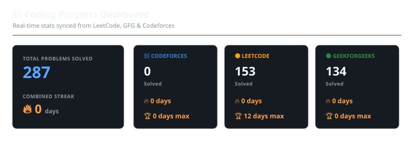

# Hi 👋, I'm Gaurav Kasaudhan

I'm a **Computer Science & Data Analytics** student at **IIT Patna**. I am highly passionate about Quantitative Research, Machine Learning, and Data Structures & Algorithms.

---

## 🧠 Coding Progress Dashboard

Here is a live summary of my solved problems across platforms, dynamically updated every 6 hours via GitHub Actions.

### [🔗 Click here to view the Interactive Coding Analytics Dashboard](https://gauravkasaudhan06.github.io/gauravkasaudhan06/)
*The interactive dashboard features platform filtering, difficulty metrics, active days, and a detailed submissions calendar heatmap.*

---

## 🚀 Coding Profiles

- **LeetCode**: [leetcode.com/u/gauravk006](https://leetcode.com/u/gauravk006/)
- **GeeksforGeeks**: [geeksforgeeks.org/profile/gauravkasa0dfs](https://www.geeksforgeeks.org/profile/gauravkasa0dfs)
- **Codeforces**: [codeforces.com/profile/gauravkasaudhan206](https://codeforces.com/profile/gauravkasaudhan206)

---

## 📊 GitHub Stats

  
  

---

## 💻 Tech Stack & Interests

- **Languages**: Python, C++, SQL, JavaScript, HTML/CSS
- **Interests**: Machine Learning, Data Analytics, Quantitative Analysis, DSA
- **Tools**: Git, Jupyter Notebook, VS Code

---
*Created and maintained by [Antigravity AI Assistant](https://github.com/google-deepmind) pairing with Gaurav.*
